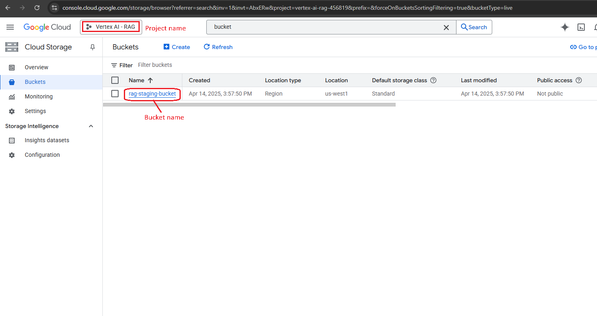
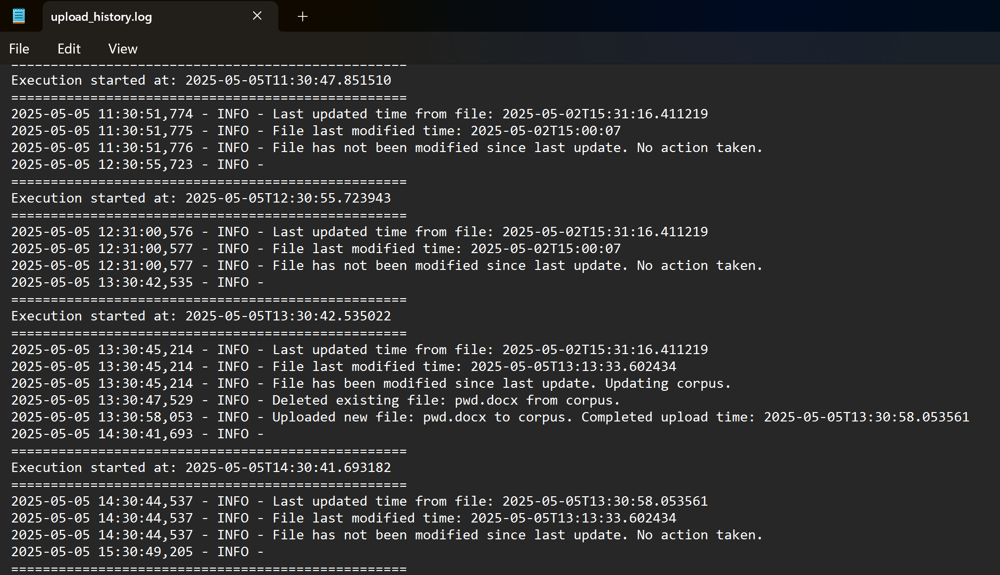

# RAG-Powered Document Assistant with Local GUI.
## Project Overview
This project is a comprehensive solution for document-based question answering and password reminders. It leverages the Retrieval-Augmented Generation (RAG) agent using Google Vertex AI and the Agent Development Kit (ADK) to provide accurate and context-aware responses. The project is developed based on the source repo: [Documentation Retrieval Agent](https://github.com/google/adk-samples/tree/main/python/agents/RAG). The system includes additional features for automatic document updates, re-indexing, and a local GUI for user interaction.

## Features
- **Password Reminder and Document Q&A:**
  - Retrieve answers to document-related questions.
  - Provide password reminders securely.
- **RAG Agent Integration:**
  - Uses Google Vertex AI and ADK for Retrieval-Augmented Generation.
  - Synthesizes responses with citations from relevant documents.
- **Automatic Updates:**
  - Documents are auto-updated and re-indexed using a task scheduler.
  - Scripts: `schedule_run.vbs` and `check_upload_new_pwd_file.py`.
- **Local GUI:**
  - User-friendly interface implemented in `app.py`. Its replace the default CLI mode from the original repo with some extra features (historical message threads management).

## Installation, Implementation, Deployment and Evaluation 
Follow the instructions on the [RAG-README.md](RAG-README.md).

### IAM Roles
The account to run the setup corpus and upload document needs to have the following IAM Roles:
* Storage Admin
* Vertex AI Administrator

After running the permission setup script `grant_permission.sh`, the service account will be created with the format:
```shell
service-${PROJECT_NUMBER}@gcp-sa-aiplatform-re.iam.gserviceaccount.com
```
To verify if the script ran successfully, check that service account will be granted the following roles in IAM:
* Vertex AI Custom Code Service Agent
* RAG Corpus Query Role

### Create your own storage bucket for the GCloud project
The instructions in the original README and the source repository did not mention anything about the `STAGING_BUCKET` in the deployment code (`deployment/deploy.py`), which is configured with the same variable name in the `.env` environment file . If your GCloud project does not already have a bucket created, you need to create one. The staging bucket is used to temporarily store artifacts and deployment files required by Vertex AI during the deployment process. 

Follow these instructions to create a new bucket for your project: [Create a bucket](https://cloud.google.com/storage/docs/creating-buckets#console).



## Summary of RAG Agent
The RAG agent is designed to answer document-related questions by leveraging the Vertex AI RAG Engine. It retrieves relevant snippets and synthesizes responses using an LLM. Key features include:
- Retrieval-Augmented Generation for accurate answers.
- Citation support for transparency.
- Integration with Google Cloud services.

For more details, refer to the [RAG-README.md](RAG-README.md).

## Automatic Document Updates
- **Task Scheduler:** Automates the execution of scripts.
- **Scripts:**
  - `schedule_run.vbs`: Schedules periodic tasks.
  - `check_upload_new_pwd_file.py`: 
    + Checks for new documents edited and updates the corpus (delete old document and upload updated document to the corpus).
    + Log corpus checking & updating history to log file (`schedule/upload_history.log`)

    


## Local GUI
The local GUI, implemented in `app.py`, provides an intuitive and user-friendly interface for interacting with the system. It allows users to:

- Submit queries related to uploaded documents.
- Retrieve password reminders securely.
- View responses generated by the RAG agent in real-time.
- Historical thread tracking and managing (view & delete old threads)

The GUI is designed to simplify user interaction, making it accessible even for non-technical users. To run the GUI, execute the following command:

```bash
python app.py
```
In Windows, users can create a desktop shortcut linked to the `run_app.bat` file for quick access. Simply right-click the file, select "Create Shortcut," and place the shortcut on your desktop. Double-clicking the shortcut will launch the application effortlessly.

